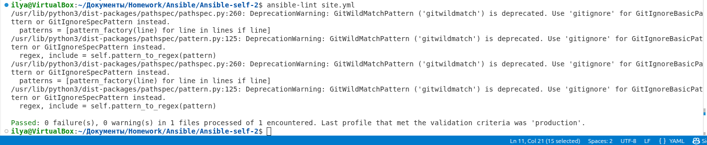
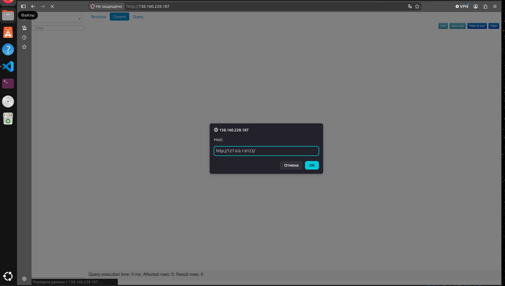

# Ansible Playbook

----------------------------------- ---------------------------------------------------
**Студент**                         Демин Илья Викторович

**GitHub репозиторий**              https://github.com/deminilyadev-maker/Ansible.git
----------------------------------- ---------------------------------------------------

## Описание

Playbook `site.yml` предназначен для автоматизированной установки и настройки компонентов инфраструктуры на виртуальных машинах Yandex Cloud.

Playbook выполняет установку и настройку:

- **ClickHouse** — устанавливает необходимые пакеты, запускает `clickhouse-server` и создаёт базу данных `logs`;
- **Lighthouse** — устанавливает NGINX, загружает Lighthouse из GitHub и настраивает NGINX для публикации Lighthouse;
- **Vector** — загружает дистрибутив Vector заданной версии, распаковывает его и выполняет установку.

Конфигурационные файлы управляются через Jinja2-шаблоны. При изменении конфигурации используются handlers для применения изменений.

---

## Lighthouse

Для Lighthouse используется репозиторий:

```text
https://github.com/VKCOM/lighthouse.git
```

Playbook выполняет следующие действия:

1. устанавливает необходимые зависимости;
2. устанавливает NGINX;
3. загружает Lighthouse из GitHub;
4. размещает Lighthouse в `/opt/lighthouse`;
5. разворачивает конфигурацию NGINX из Jinja2-шаблона;
6. выполняет reload NGINX при изменении конфигурации.

Основные переменные Lighthouse:

```yaml
nginx_user_name: nginx
lighthouse_vcs: "https://github.com/VKCOM/lighthouse.git"
lighthouse_location_dir: "/opt/lighthouse"
```

Конфигурация находится в:

```text
templates/lighthouse.conf.j2
```

---

## ClickHouse

Для ClickHouse используются следующие параметры:

```yaml
clickhouse_version: "22.3.3.44"

clickhouse_packages:
  - clickhouse-client
  - clickhouse-server
  - clickhouse-common-static
```

Playbook устанавливает указанные RPM-пакеты, запускает сервис `clickhouse-server` и создаёт базу данных:

```text
logs
```

---

## Vector

Для Vector используется параметр версии:

```yaml
vector_version: "0.34.1"
```

Playbook:

- скачивает архив Vector;
- распаковывает его;
- устанавливает Vector;
- разворачивает конфигурацию из Jinja2-шаблона;
- перезапускает Vector при изменении конфигурации.

---

## Параметры

Основные параметры playbook вынесены в `group_vars`.

### Lighthouse

Файл:

```text
group_vars/lighthouse.yml
```

| Параметр | Назначение |
|---|---|
| `nginx_user_name` | Пользователь NGINX |
| `lighthouse_vcs` | Git-репозиторий Lighthouse |
| `lighthouse_location_dir` | Директория установки Lighthouse |

### ClickHouse

| Параметр | Назначение |
|---|---|
| `clickhouse_version` | Версия ClickHouse |
| `clickhouse_packages` | Устанавливаемые пакеты |

### Vector

| Параметр | Назначение |
|---|---|
| `vector_version` | Версия Vector |

---

## Inventory

Для запуска используется:

```text
inventory/prod.yml
```

В inventory определены группы:

```text
clickhouse
lighthouse
vector
```

Подключение к виртуальным машинам выполняется по SSH:

```yaml
ansible_user: idemin
ansible_ssh_private_key_file: /home/ilya/ssh$$$
```

Запуск playbook:

```bash
ansible-playbook -i inventory/prod.yml site.yml
```

---

## Теги

В текущей версии `site.yml` пользовательские Ansible-теги не определены.

Для выбора целевых узлов используется inventory:

```bash
-i inventory/prod.yml
```


## Проверка ansible-lint

Playbook проверен с помощью:

```bash
ansible-lint site.yml
```

Скриншот проверки:



---

## Финальная проверка Lighthouse

После выполнения playbook была выполнена проверка доступности Lighthouse.



---
